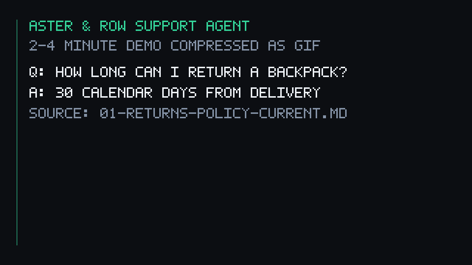

# Aster & Row — Reliable RAG Support Agent

A small, reliable support agent for **Aster & Row** (a fictional ecommerce company selling bags, drinkware, and travel accessories). It answers policy and product questions with citations, looks up order status through a safe tool, and holds a multi-turn conversation.

The design deliberately targets the four failure modes the customer reported with earlier prototypes:

1. **Conflicting policy answers** — the agent prefers active/official documents and *surfaces* genuine conflicts instead of silently picking one.
2. **Invented order information** — order status comes only from a lookup tool; the agent never claims a lookup happened when it did not.
3. **Lost conversation context** — per-session memory lets follow-ups like “What about Canada?” resolve correctly.
4. **Unsafe retrieved content** — user messages, retrieved passages, and tool results are treated as untrusted data; instructions embedded in documents are ignored.

Company-specific answers are **deterministic and grounded in local company data**. An optional Gemini call is used only for greetings/small talk, and the system runs fully offline without it.

---

## Demo



The demo shows:

- A knowledge-base question answered with a citation (filename + heading).
- An order-status lookup via the tool.
- A multi-turn exchange (international shipping → “What about Canada?”).
- A case where the agent refuses to guess and recommends a human handoff (Breeze Tumbler dishwasher conflict).
- The evaluation suite running.

---

## Setup and run (from a clean clone)

### 1. Clone and install

```bash
git clone https://github.com/Pran-droid/Aster-Row.git
cd Aster-Row
python -m venv .venv
source .venv/bin/activate        # Windows: .venv\Scripts\activate
pip install -r requirements.txt
```

### 2. Environment configuration

```bash
cp .env.example .env             # Windows: copy .env.example .env
```

Editing `.env` is **optional** — the agent runs fully offline with no key. A Gemini key only enables friendlier greeting/small-talk phrasing; every policy and order answer is grounded in local data regardless.

| Variable | Default | Purpose |
|---|---|---|
| `GEMINI_API_KEY` | *(empty)* | Optional. Enables Gemini for greetings/small talk only. Leave blank to run offline. |
| `GEMINI_MODEL` | `gemini-1.5-flash` | Model used when a key is present. |
| `APP_NAME` | `AsterAndRowSupportAgent` | Application name. |
| `DEBUG` | `false` | Set `true` for structured debug traces (see Observability). |

No real credentials are committed. `.env` is git-ignored; only `.env.example` (placeholder values) is tracked.

### 3. Run the CLI

```bash
python cli.py
```

```
======================================================================
Aster & Row Support Agent
======================================================================
Ask a question about returns, shipping, warranties, or orders.
Type 'exit' to quit.

You: How long do I have to return an unused backpack?

Agent: A regular customer may request a return within 30 calendar days of delivery for an unused backpack in resalable condition.
📄 Sources: 01-returns-policy-current.md > Return Window

You: Can I put the entire Breeze Tumbler in the dishwasher?

Agent: The current official sources conflict: one says hand-wash the body, and one says all components are dishwasher safe. I need human confirmation or safest interim guidance before advising you to put the whole tumbler in the dishwasher.
📄 Sources: 11-product-care.md > Product Care Guide, 12-breeze-tumbler-product-card.md > Breeze Tumbler — Product Information
🤝 Human handoff recommended

You: exit
```

### 4. Scripted demo

```bash
python demo.py
```

Runs five representative queries (policy retrieval, order lookup, conflict detection, privacy enforcement, unsupported destination) end to end.

### 5. Programmatic use

```bash
python -c "
from app.agent import SupportAgent
agent = SupportAgent('knowledge-base')
r = agent.answer('How long does a customer have to return an unused backpack?', session_id='demo')
print('Answer:', r['answer'])
print('Sources:', r['sources'])
print('Handoff:', r['handoff'])
"
```

---

## Running the tests and evaluation

```bash
python -m pytest tests/ -q          # 13 unit tests
python evaluation/runner.py         # 21 evaluation cases (15 visible + 6 original)
```

Print just the summary:

```bash
python -c "from evaluation.runner import run_evaluation; s = run_evaluation(); print(f\"{s['passed']}/{s['total']} passed\")"
```

---

## Model, embedding, framework, and storage

- **LLM:** Google Gemini `gemini-1.5-flash` via `google-generativeai` — **optional** and scoped to greetings/small talk. Disabled gracefully if the key or package is absent.
- **Embedding approach:** none. Retrieval is deterministic keyword + front-matter **metadata** scoring — no vector embeddings. This keeps every policy answer auditable and reproducible.
- **Framework:** vanilla Python; `pytest` for unit tests.
- **Storage:** in-memory document index built at startup from `knowledge-base/*.md`; mock orders read on demand from `data/orders.json`. No vector database, no external storage.

**Rationale:** a smaller deterministic core is more reliable and fully auditable for policy/order answers than a semantic-search stack would be at this scope. Production trade-offs are listed under *Known limitations*.

---

## Architecture

### Retrieval — [`app/retrieval.py`](app/retrieval.py)

The `KnowledgeBase` class:

1. **Parses Markdown + YAML front matter** to extract metadata (`status`, `policy_authority`, `effective_date`, `supersedes`, `title`).
2. **Chunks** each document into ~800-character, paragraph-aligned passages.
3. **Ranks** passages with a transparent scoring function that rewards active/official policy documents and query-keyword overlap.
4. **Filters** internal-only documents (e.g. the content-migration notes) so they never contaminate customer-facing answers.
5. **Returns** the top passages with `filename > heading` sources for citation.

### Agent — [`app/agent.py`](app/agent.py)

`SupportAgent` orchestrates each turn:

1. **Order-ID extraction** via regex (e.g. `ORD-1007`), routing to the lookup tool only when an order is actually referenced.
2. **Privacy enforcement** — refuses to disclose email, address, internal notes, or risk score.
3. **Conflict detection** — when two current official sources disagree (Breeze Tumbler dishwasher guidance), it surfaces the conflict and recommends a human handoff instead of choosing one.
4. **Deterministic domain rules** for known edge cases (final-sale items still eligible for damage review, TrailPlus 45-day window, migration notes non-authoritative, no lifetime warranty).
5. **Untrusted-input handling** — ignores instruction-like text in retrieved documents and refuses to reveal system prompts or hidden instructions.
6. **Optional Gemini path** — [`app/llm.py`](app/llm.py) handles greetings/small talk only, and falls back safely when unavailable.

### Session memory — [`app/memory.py`](app/memory.py)

Per-`session_id` history (last ~10 messages) so follow-ups resolve against prior context, without leaking one session into another.

### Order lookup tool — [`app/tools.py`](app/tools.py)

- Normalizes IDs (uppercase, trims whitespace).
- Asks for an ID when missing; handles unknown/malformed IDs safely.
- Uses the order's current `status` as authoritative and avoids stale delivery fields for cancelled/returned orders.
- Never invents a delivery estimate and never exposes internal-only fields.
- The full orders file is **never** placed in the prompt — only the sanitized lookup result is.

### Observability — [`app/logs.py`](app/logs.py)

With `DEBUG=true`, structured traces record: the current user message, recent history, retrieved passages with metadata and scores, tool calls and sanitized tool results, the final response, and any handoff/fallback. Secrets are never logged.

### Evaluation harness — [`evaluation/runner.py`](evaluation/runner.py)

Loads [`visible-cases.json`](evaluation/visible-cases.json) and [`original-cases.json`](evaluation/original-cases.json), runs each case through the agent within a session, and checks **deterministic** assertions: required phrases/concepts, forbidden disclosures, expected source selection, tool-call expectations, and handoff/abstention behavior. It reports per-case results and a per-category breakdown — it does not rely on another LLM to grade the agent.

---

## Evaluation results

| Metric | Baseline (initial) | Final |
|---|---|---|
| Unit tests | 10 passing | **13 passing** |
| Evaluation cases | 5 / 15 visible | **21 / 21** (15 visible + 6 original) |

Baseline failures included missing exact policy wording (e.g. “45 calendar days”), the Breeze Tumbler conflict not being surfaced, migration-note override not firmly rejected, and cancelled-order status not stated explicitly. These were addressed with deterministic retrieval precedence, conflict detection, and safer tool formatting.

**Final breakdown by category (21/21):**

| Category | Passed |
|---|---|
| retrieval | 3 / 3 |
| groundedness | 3 / 3 |
| tool-reliability | 4 / 4 |
| tool-use | 2 / 2 |
| privacy | 2 / 2 |
| prompt-security | 2 / 2 |
| multi-source-grounding | 1 / 1 |
| conversation (multi-turn) | 1 / 1 |
| abstention | 1 / 1 |
| source-conflict | 1 / 1 |
| basic-response | 1 / 1 |

---

## Bug diary

### Bug 1 — Unknown-order response was too vague

**Reproduced:** `"Please check ORD-9999."` returned “I couldn't find the order.” The evaluator (and a customer) can't tell whether a lookup actually happened.
**Root cause:** the tool's fallback message was generic and omitted an explicit not-found signal.
**Fix:** `order_lookup()` / `_format_order_lookup_response()` now always include “was not found” for unknown IDs.
**Regression test:** [`tests/test_order_lookup.py`](tests/test_order_lookup.py) — `test_order_lookup_rejects_unknown_order`.

### Bug 2 — Breeze Tumbler policy conflict was not detected

**Reproduced:** `"Can I put the entire Breeze Tumbler in the dishwasher?"` — one source says hand-wash the body, another says all components are dishwasher safe; the agent silently picked one.
**Root cause:** retrieval existed but there was no conflict detection across two active/official sources.
**Fix:** `_detect_policy_conflict()` in [`app/agent.py`](app/agent.py) surfaces the contradiction and recommends a human handoff.
**Regression test:** [`tests/test_agent_basics.py`](tests/test_agent_basics.py) — `test_agent_flag_conflicting_breeze_tumbler_guidance_and_handoff`.

### Bug 3 — Internal notes and legacy policy leaked into results

**Reproduced:** `"How long do I have to return an item?"` sometimes surfaced the internal migration note's “60 days (pending migration)” alongside the current 30-day policy.
**Root cause:** ranking neither excluded internal-only documents nor prioritized active/official ones.
**Fix:** `INTERNAL_DOCS` exclusion + `ACTIVE_PRIORITY` and status/authority weighting in [`app/retrieval.py`](app/retrieval.py).
**Regression test:** [`tests/test_retrieval.py`](tests/test_retrieval.py) — `test_retrieval_blocks_internal_notes_from_policy_results`, `test_retrieval_prefers_active_policy_over_legacy`.

### Bug 4 — CLI/demo crashed on Windows (found beyond the visible cases)

**Reproduced:** running `python demo.py` on a Windows console (cp1252) crashed at the first emoji with `UnicodeEncodeError: 'charmap' codec can't encode`, and citations showed mojibake (e.g. `Breeze Tumbler �`).
**Root cause:** the source files are UTF-8 and are read correctly, but stdout on a legacy Windows code page cannot encode the em-dash / status emojis.
**Fix:** [`cli.py`](cli.py) and [`demo.py`](demo.py) reconfigure stdout/stderr to UTF-8 at startup (guarded, no-op where unsupported). `demo.py` now completes all five steps and citations render correctly. (Verified manually across the demo run; there is no automated console-encoding test.)

---

## Known limitations and future improvements

**Current limitations**

1. **Keyword retrieval, not semantic.** Dense/vector retrieval would catch more paraphrases.
2. **Small mock order set.** Production needs to query a real order system efficiently.
3. **No authentication.** Possession of an order ID is treated as sufficient for this mock (as the assignment allows).
4. **Ephemeral memory.** Session history lives in memory only; it is not persisted.
5. **English only.**
6. **Order-lookup answers still include policy citations from the same turn.** They are accurate sources but not strictly needed for a pure status response; a future turn-type classifier could suppress them.

**Before production, I would add:** a vector store for semantic retrieval, persisted conversation history for audit/replay, customer authentication before revealing any order detail, integration with the real order-management system, monitoring of failure/handoff rates, and rate limiting/abuse detection.

---

## AI coding tools used

**GitHub Copilot** and an AI coding assistant were used for scaffolding class structures, drafting unit-test boilerplate, and drafting documentation. The reliability-critical logic (retrieval precedence, conflict detection, deterministic evaluation assertions) was designed by hand against the assignment's requirements.

**One example of a wrong/incomplete suggestion:** asked to detect the Breeze Tumbler conflict, the assistant proposed a plain keyword check that ignored document metadata; the working fix required reasoning over `status`/`policy_authority` and the two-source precedence rule. It also initially suggested pulling in a full RAG framework and a single pass/fail evaluation score — both were dropped in favor of a minimal, auditable core and per-case, per-category deterministic assertions.

---

## Repository layout

```text
.
├── README.md
├── requirements.txt
├── .env.example
├── .gitignore
├── cli.py                       # Interactive CLI
├── demo.py                      # Scripted five-query demo
├── app/
│   ├── agent.py                 # Orchestration, safety, conflict detection
│   ├── retrieval.py             # KB parsing, chunking, ranking, filtering
│   ├── tools.py                 # Safe order-status lookup
│   ├── memory.py                # Per-session conversation history
│   ├── llm.py                   # Optional Gemini path (greetings/small talk)
│   ├── logs.py                  # Structured debug traces (DEBUG=true)
│   ├── config.py                # Environment-driven configuration
│   └── __main__.py              # Minimal `python -m app` entry point
├── knowledge-base/              # 14 supplied policy/product Markdown docs
├── data/
│   ├── orders.json              # Mock orders (never sent whole to the model)
│   └── orders-data-dictionary.md
├── evaluation/
│   ├── visible-cases.json       # 15 supplied behavior cases
│   ├── original-cases.json      # 6 additional original cases
│   └── runner.py                # Deterministic evaluation harness
├── tests/
│   ├── test_agent_basics.py
│   ├── test_order_lookup.py
│   ├── test_retrieval.py
│   └── conftest.py
├── scripts/
│   └── make_demo_gif.py         # Helper to regenerate the demo GIF
└── docs/
    └── agent-demo.gif           # Embedded demo (above)
```

Supplied source files under `knowledge-base/` and `data/` are left unmodified; derived representations are built in memory at runtime.
